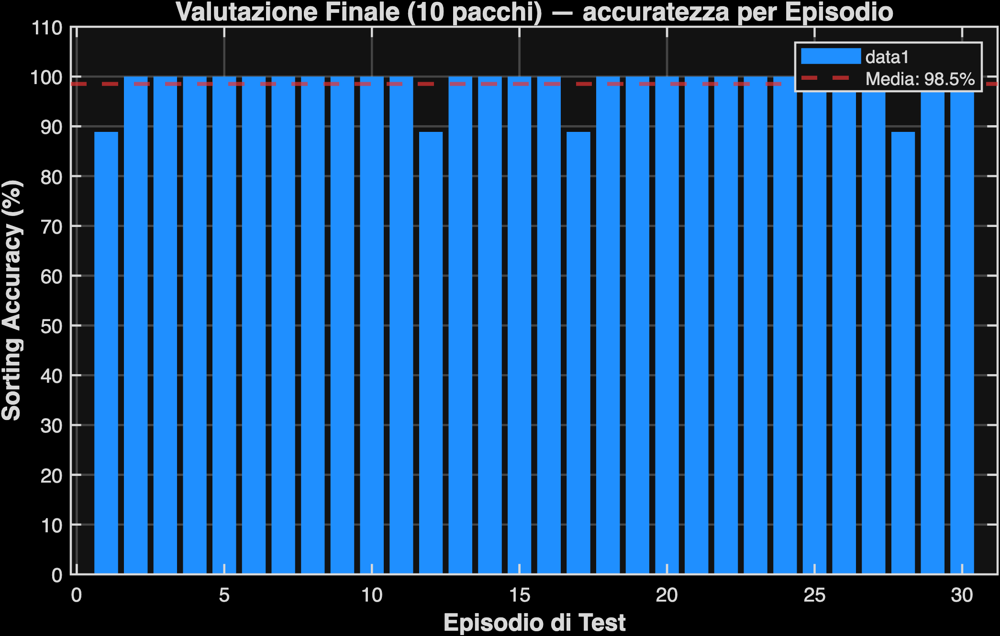

# Report Globale: Curriculum Adattivo Continuo

*   **Data di Completamento**: 23-May-2026 22:37:12
*   **Livello Finale Raggiunto**: 10 Pacchi
*   **Tempo di Calcolo Totale**: 355.2 secondi (5.92 minuti)

## Performance Finali (su 10 pacchi)

| Metrica | Valore |
| :--- | :--- |
| **Sorting Accuracy Media** | **98.5%** |
| Deviazione Standard | 3.8% |
| Episodi Totali Eseguiti | 3299 |

## Visualizzazioni

### Curva di Addestramento Adattiva
*(Nota: i gradini nel grafico corrispondono ai Level Up automatici della simulazione)*

### Istogramma Valutazione Finale

