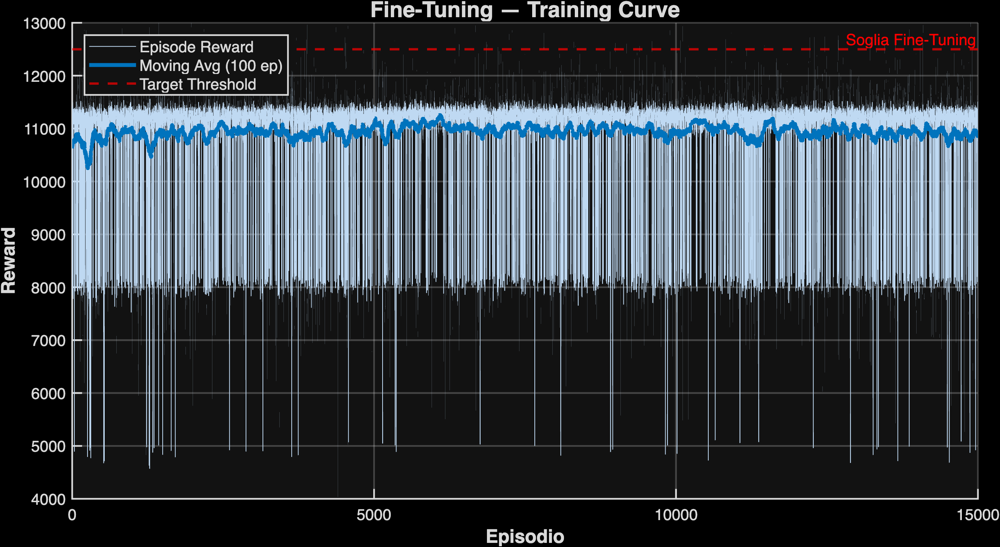
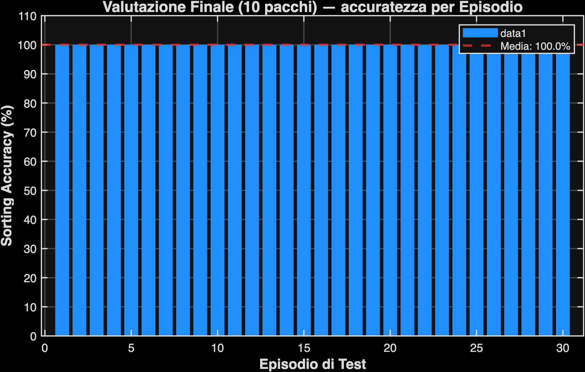

# Report Globale: Fine-Tuning

*   **Data di Completamento**: 24-May-2026 18:11:45
*   **Modello Base**: Finetuned_Run_14_ProfParams_SafeGap
*   **Tempo di Calcolo Totale**: 4167.1 secondi (69.45 minuti)

## Performance Finali (su 10 pacchi)

| Metrica | Valore |
| :--- | :--- |
| **Sorting Accuracy Media** | **100.0%** |
| Deviazione Standard | 0.0% |
| Episodi Totali Eseguiti | 15000 |

## Visualizzazioni

### Curva di Addestramento (Fine-Tuning)

### Istogramma Valutazione Finale

