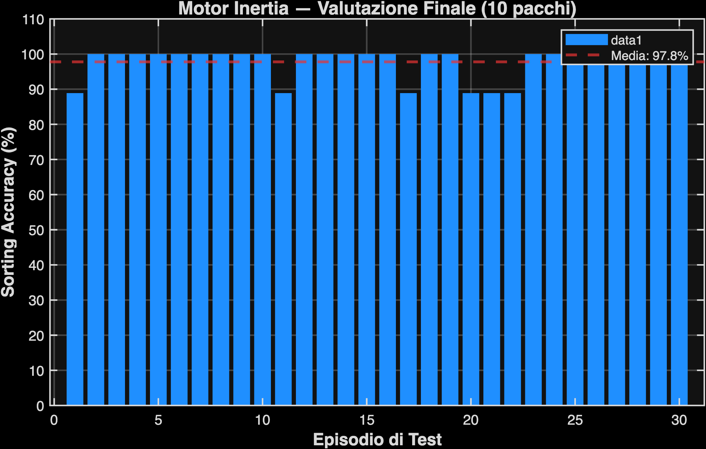

# Report: Motor Inertia Fine-Tuning

## Modello Fisico
Dinamica del motore sotto carico: `V(t+dt) = V(t) + (dt/tau) * (V_target - V(t))`

| Parametro | Valore |
| :--- | :--- |
| tau_0 (a vuoto) | 0.020 s |
| tau_k (fattore inerziale) | 0.015 s/kg |
| Massa pacchi | [1.0, 10.0] kg |
| tau (pacco leggero, 1 kg) | 0.035 s |
| tau (pacco pesante, 10 kg) | 0.170 s |

## Performance Finali

| Metrica | Valore |
| :--- | :--- |
| **Data** | 27-May-2026 21:20:22 |
| **Modello Base** | Finetuned_Run_16_RiskAverse (Curriculum) |
| **Tempo di Calcolo** | 4652.7 s (77.55 min) |
| **Sorting Accuracy Media** | **97.8%** |
| Deviazione Standard | 4.5% |
| Episodi Totali | 15000 |

## Visualizzazioni

