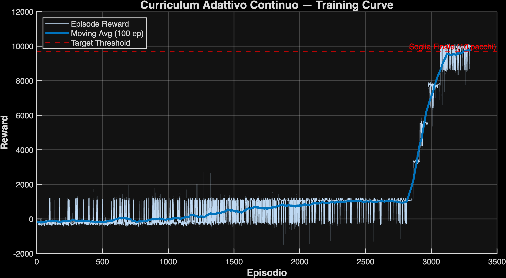
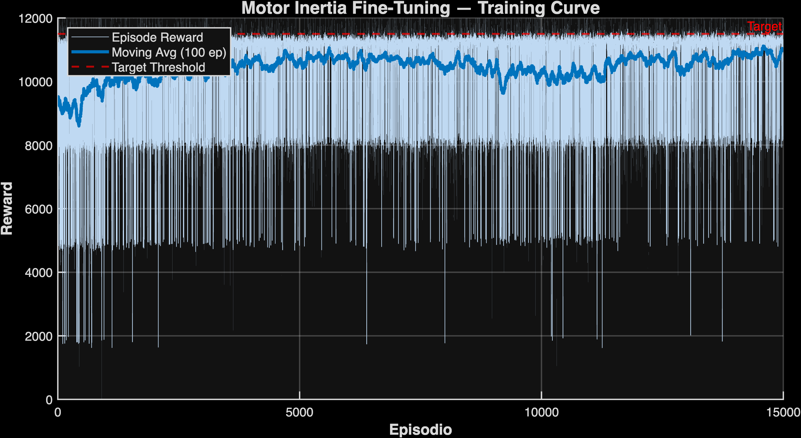

# 📦 Parcel Singulation via Reinforcement Learning (MATLAB)

> **University Project — Machine Learning for Mechanical Systems (MLMS)**  
> Politecnico di Milano · A.Y. 2025/2026

[](https://www.mathworks.com/)
[](https://arxiv.org/abs/1707.06347)
[]()
[](LICENSE)

---

## 🎬 Demo — Trained Agent in Action

<p align="center">
  
</p>

> Real-time simulation of the trained PPO agent controlling the 5×5 AMS grid: 10 parcels of random dimensions are continuously singulated into a single-file stream onto the high-speed exit conveyor (1.9 m/s) without collisions.

---

## 🎯 Project Overview


This project addresses the **parcel singulation problem** in automated logistics: given a batch of **10 parcels of random sizes**, a Reinforcement Learning agent must control an **AMS (Automated Material Sorting)** grid to convey all parcels through the system **individually**, maintaining a safe physical clearance between them at the high-speed exit conveyor (1.9 m/s).

The agent uses the **PPO (Proximal Policy Optimization)** algorithm and controls **50 continuous actions** — the rotation angle and belt speed of each cell in a 5×5 AMS grid.

The project was developed in three progressive stages:
1. **Baseline** — design of observation space and reward function from scratch
2. **Curriculum Learning** — adaptive difficulty scheduling for faster convergence
3. **Transfer Learning under Motor Inertia** — robustness to load-dependent physical dynamics

---

## 🏭 The Physical System

The simulation models a **5×5 grid of AMS roller units** (total area: 1.0 m × 1.0 m):

| Parameter | Value |
|---|---|
| Cell size (`d_AMS`) | 0.20 m |
| Grid dimensions | 5 × 5 (1.0 m × 1.0 m) |
| Exit conveyor speed | 1.9 m/s |
| Number of parcels | up to 10 (random sizes) |
| Parcel size range | 0.05 m – 0.40 m |
| Agent actions | 50 continuous (rotation + speed per cell) |
| Observation vector | 100 elements (10 features × 10 parcels) |
| Simulation timestep | 0.01 s |

Each AMS cell independently controls:
- **Rotation angle** θ ∈ [−45°, +45°] → steers the parcel laterally
- **Belt speed** v ∈ [0.5, 2.2] m/s → controls longitudinal velocity

---

## 📁 Repository Structure

```
reinforcement-learning-multi-actuator-control/
│
├── 1_Baseline/                   # Stage 1: Direct training from scratch
│   ├── RL_environment.m          # Custom MATLAB RL environment (MATLABEnvironment)
│   ├── RL_main.m                 # Training script + visualization launcher
│   ├── AMSVisualizer.m           # Real-time 2D visualization of the AMS grid
│   ├── evaluate_agent.m          # Sorting accuracy evaluation (N episodes)
│   └── Risultati_100_percent/    # Saved results: training curve, PNG plots
│
├── 2_Curriculum/                 # Stage 2: Adaptive Curriculum Learning
│   ├── RL_curriculum_env.m       # Environment with Self-Paced Learning logic
│   ├── RL_curriculum_train.m     # Training script for the adaptive curriculum
│   ├── RL_finetune.m             # Fine-tuning script (loads curriculum checkpoint)
│   ├── AMSVisualizer.m           # Visualizer (same as Baseline)
│   ├── evaluate_curriculum.m     # Evaluation script for curriculum agent
│   └── Risultati_Curriculum_98_5/  # Results at 98.5% accuracy (curriculum checkpoint)
│       └── Risultati_Finetuning_100/ # Results after fine-tuning (100% accuracy)
│
└── 3_Inertia/                    # Stage 3: Transfer Learning + Motor Inertia
    ├── RL_inertia_env.m          # Environment with load-dependent motor model
    ├── RL_inertia_finetune.m     # Transfer learning fine-tuning script
    ├── AMSVisualizer.m           # Visualizer
    ├── evaluate_inertia.m        # Evaluation script
    └── Risultati_TransferLearning_97_8/  # Results: 97.8% accuracy with inertia
```

---

## 🧠 Technical Approach

### Stage 1 — Baseline: Reward Engineering

The template environment provided no reward signal or observation space. Both were designed from scratch.

**Observation Vector (100 elements):**  
10 features per parcel × 10 parcels, all normalized to [0, 1]:

| Feature | Description |
|---|---|
| Active flag | 1 if parcel is on grid, 0 otherwise |
| x position | Normalized by grid width |
| y position | Normalized by grid length |
| Diameter | Normalized by 2×d_AMS |
| Longitudinal velocity (vy) | Normalized by 2.2 m/s |
| Row index (i) | Normalized by number of rows |
| Column index (j) | Normalized by number of columns |
| Exited flag | 1 if parcel crossed exit line |
| Exit sequence marker | Binary flag for singulation validation |
| Global time | Normalized by episode duration |

**Final Reward Function (8 terms):**

| Term | Formula | Purpose |
|---|---|---|
| Forward Progress | `dy × 5` | Incentive to move parcels toward exit |
| Lateral Spread | `min(gap_x, 0.2) × 1.5` | Encourages physical lane separation |
| Longitudinal Spread | `min(gap_y, 0.2) × 2.0` | Encourages queue formation |
| Velocity Gradient | `Δv × 0.3` (only if gap_y < 0.2 m) | Braking subsidy for early separation |
| Time Penalty | `−0.3` per step | Prevents stalling |
| Wall Penalty | up to `−2.0` | Discourages lateral boundary hugging |
| Exit Bonus | `+100` | Parcel crosses exit line |
| Singulation Reward | `+1000` or `−300` | Physical gap check at y = 1.05 m |

> The reward function evolved through **6 iterative phases**, correcting emergent behaviors like wall-hugging, reward hacking (velocity gradient exploit), and geometric overlap miscounting.

**PPO Architecture:**
- Actor/Critic: fully-connected networks [512 → 256 → 128]
- Actor output: dual-head Gaussian (mean + std dev)
- Exploration: ClipFactor = 0.2, LR = 3e-4 → fine-tuned with ClipFactor = 0.02, LR = 1e-4

**Result: 100% sorting accuracy**

---

### Stage 2 — Curriculum Learning

Rather than training on 10 parcels immediately, the agent starts with 2 parcels and advances automatically via a **Self-Paced Learning** mechanism inside `RL_curriculum_env.m`.

**Automatic Level-Up Logic:**

```
Curriculum Level (parcels):  2 → 4 → 6 → 8 → 10
Rolling avg reward threshold:   >1100 → >3300 → >5450 → >7700
```

After reaching 98.5% at curriculum level 10, a **fine-tuning stage** (`RL_finetune.m`) with conservative hyperparameters (ClipFactor = 0.02, LR = 1e-5) brought the agent to:

**Result: 100% deterministic sorting accuracy (std: 0.0%)**

---

### Stage 3 — Transfer Learning under Motor Inertia

A more realistic **load-dependent motor model** was introduced:

```
V(t+dt) = V(t) + (dt/τ) × (V_target − V(t))
where τ = τ₀ + τ_k × m_box
```

| Parameter | Value |
|---|---|
| τ₀ (unloaded) | 0.020 s |
| τ_k (inertia factor) | 0.015 s/kg |
| Parcel mass range | 1.0 – 10.0 kg |
| τ (1 kg parcel) | 0.035 s |
| τ (10 kg parcel) | 0.170 s |

The pre-trained curriculum weights were transferred to `RL_inertia_env.m` and fine-tuned for 15,000 episodes.

**Result: 97.8% sorting accuracy** (std: 4.5%) — robust to mass-dependent dynamics

---

## 📊 Results Summary

| Stage | Method | Episodes | Sorting Accuracy |
|---|---|---|---|
| 1 — Baseline | Direct training (10 parcels) | ~25,000 | **100.0%** |
| 2 — Curriculum | Adaptive (2→10 parcels) + fine-tune | ~3,300 + fine-tune | **100.0%** (std: 0.0%) |
| 3 — Inertia | Transfer learning (curriculum → inertia env) | 15,000 | **97.8%** (std: 4.5%) |

### Training Curves

**Curriculum (Stage 2)** — note the characteristic staircase pattern at each level-up:



**Transfer Learning with Motor Inertia (Stage 3):**



---

## ⚙️ Requirements

- **MATLAB** R2023b or later
- **Reinforcement Learning Toolbox**
- **Deep Learning Toolbox**

---

## 🚀 How to Run

### Train the Baseline Agent
```matlab
cd 1_Baseline
RL_main   % set loadSavedAgent = false to train from scratch
```

### Train with Adaptive Curriculum
```matlab
cd 2_Curriculum
RL_curriculum_train   % trains from 2 to 10 parcels automatically
```

### Fine-tune after Curriculum
```matlab
cd 2_Curriculum
RL_finetune   % loads curriculum checkpoint and fine-tunes
```

### Run Transfer Learning with Motor Inertia
```matlab
cd 3_Inertia
RL_inertia_finetune   % loads curriculum weights, adapts to inertia model
```

### Visualize a Trained Agent
In any stage, set `loadSavedAgent = true` in the main training script, then run it to launch the physical visualizer.

---

## 👥 Authors

- **Francesco Cardone**
- **Tommaso Garavelli**
- **Lorenzo Ghellero**

*University project — Machine Learning for Mechanical Systems, Politecnico di Milano, A.Y. 2025/2026*

---

## 📄 License

This project is released under the [MIT License](LICENSE).
